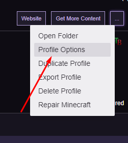
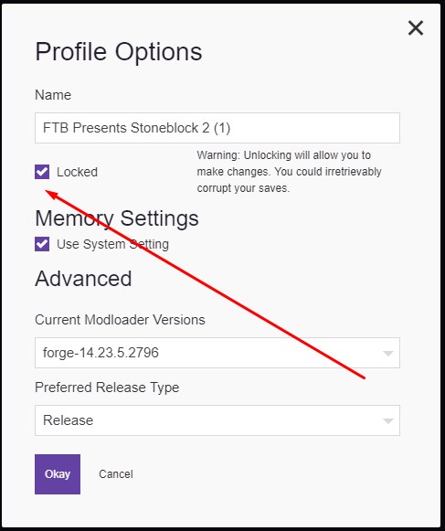

# Sockertoppar Plays FTB Presents Stoneblock 2

## Getting started

Download the modpack on the Twitch Launcher. When downloaded, go to profile options and uncheck "Locked" (see images).

This will allow you to add the additional mods that we are going to use.

## Adding new mods

The following mods should be added for you to be able to connect to the server:

| **Modname**                | **Version** |
|----------------------------|-------------|
| Agricraft                  | 2.12.0-1.12.0-a6 |
| CompactStorage             | 3.1-12 |
| ExtraCells2                | 1.12.2-2.6.2a |
| InGame Info XML (optional) | 1.12.2-2.8.2.94-universal |
| QuantumStorage             | 1.12-4.6.4 |
| Reborn Storage             | 1.12.2-3.3.2.79 |
| Refined Storage            | 1.6.12 |
| Refined Storage Addons     | 0.4.3 |
| Simple Generators          | 1.12.2-2.0.19.1 |
| StepUp                     | 1.0.2-mc1.10-1.12 |
| Tinker's JEI               | 1.0 |

## Updated the following mods

| **Modname** | **Version** |
|-------------|-------------|
| Environmental Tech | 1.12.2-2.0.19.1 |
| ValkyrieLib | 1.12.2-2.0.19.1 |

## Swaping configs

You should also use the new configs, so that your client is synced with the ones on the server. You can download it [here](https://1drv.ms/u/s!Amq7FpDvPImOsxRFCekooYPNbBdr).

## Troubleshooting

If you try to connect to the server and it tells you that you have the wrong version of a mod, simply click that mod in the modlist, press "Versions" and download the right version instead.