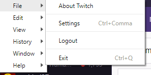
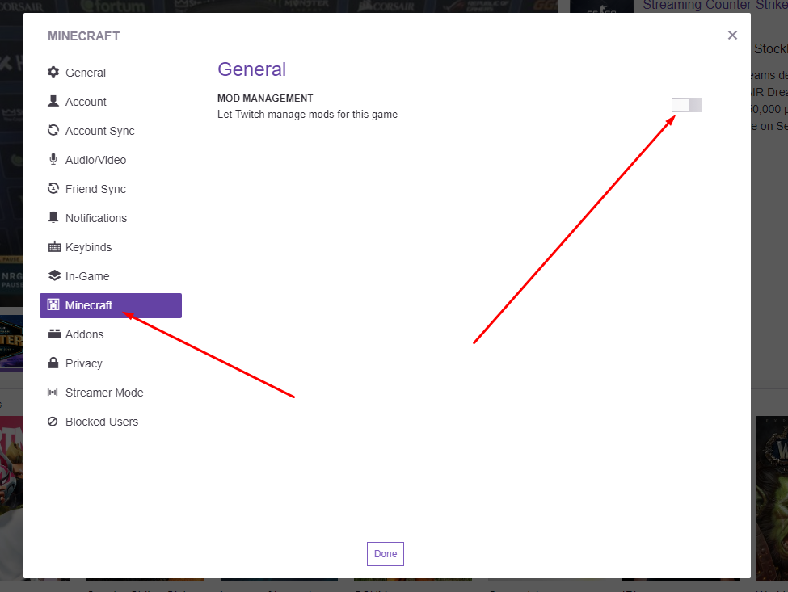
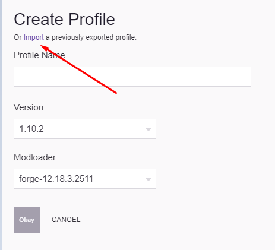

# Twitch Launcher Installation Guide

## Table of Content

- [Table of Content](#table-of-content)
- [Step 1 - Installation of Twitch Launcher](#step-1---installation-of-twitch-launcher)
- [Step 2 - Activate mod management in Twitch Launcher](#step-2---activate-mod-management-in-twitch-launcher)
- [Step 3 - Add modpack](#step-3---add-modpack)
- [Notes](#notes)

## Step 1 - Installation of Twitch Launcher

Install Twitch Launcher as usual.

## Step 2 - Activate mod management in Twitch Launcher

Navigate to settings by pressing the menu button in the top left corner:

Press the Minecraft sub-menu and then activate Mod Management:

Press Install and let it run for a while.

## Step 3 - Add modpack

When it's done, you'll see an large empty area with a menu at the top where you can press "Create Custom Profile". Press it and select "Import modpack".

Select the modpack .zip you've downloaded and it should begin the installation of the necessary files/mods. After this, you're good to go!

## Notes

If you want to add more packs, just repeat [Step 3](#step-3--add-modpack)